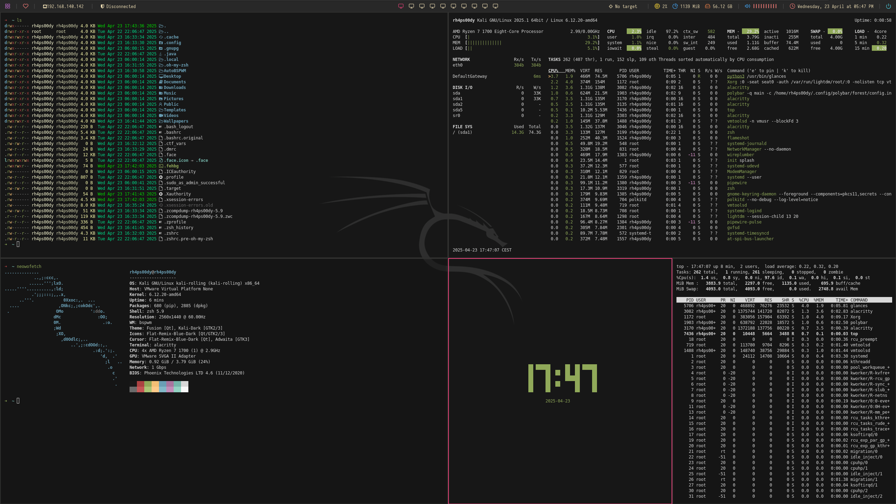
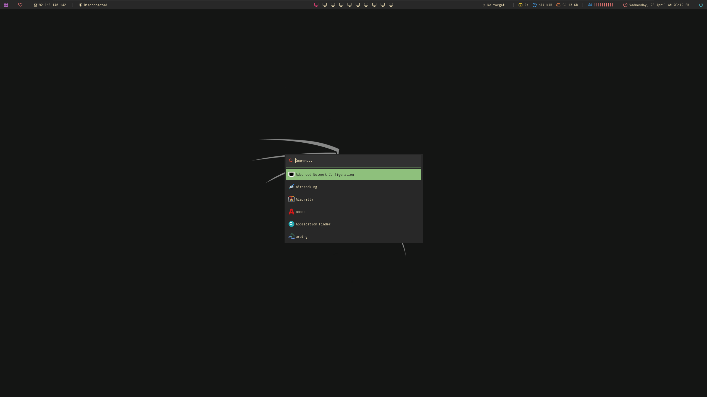

# AutoBSPWM

A fully automated script to install and configure a custom **bspwm** environment on Kali Linux systems. Designed to optimize usability, minimalistic, aesthetics, and efficiency with custom scripts, aliases, functions, and keybindings.

---

## Table of content

- [Environment Preview](#%EF%B8%8F-environment-preview)
- [Features](#-features)
- [Installation](#-installation)
- [File Overview](#-file-overview)
- [Software](#-software)
- [Aliases](#-aliases)
- [Functions](#%EF%B8%8F-functions)
- [sxhkd Keybindings](#%EF%B8%8F-sxhkd-keybindings)
- [Scripts](#-scripts)
- [Notes](#-notes)
- [Credits](#-credits)


---

## 🖼️ Environment Preview







---

## 📦 Features

- Automated install of bspwm + sxhkd + polybar + custom zsh setup
- Pre-configured scripts for system control (network, battery, volume, screenshots)
- Handy aliases and zsh functions for daily usage
- Clean and minimal dotfiles structure
- sxhkd keybindings for tiling window management

---

## 🚀 Installation

```shell
sudo apt update && sudo apt upgrade -y
git clone https://github.com/0xRh4ps00dy/AutoBSPWM.git 
cd AutoBSPWM 
bash install.sh
```

---

## 📁 File Overview

| Folder/File    | Description                                                             |
| -------------- | ----------------------------------------------------------------------- |
| **config**     | Dotfiles for `bspwm`, `sxhkd`, `polybar`, etc.                          |
| **scripts**    | Custom shell scripts for utilities (volume, screenshots, brightness...) |
| **aliases**    | zsh aliases to simplify commands                                        |
| **functions**  | zsh functions (archive extractor, note taker, timer...)                 |
| **.zshrc**     | Main zsh config with aliases/functions sourcing                         |
| **wallpapers** | Desktop wallpapers used in the setup                                    |
| **fonts**      | Fonts required by the rice setup                                        |

---

## 🧩 Software
 
This configuration uses the following software:

- **WM**: [bspwm](https://github.com/baskerville/bspwm)
- **Hotkey**: [sxhkd](https://github.com/baskerville/sxhkd)
- **Shell**: [zsh](https://www.zsh.org/)
- **Shell configuration manager**: [ohmyzsh](https://github.com/ohmyzsh/ohmyzsh)
- **Bars**: [polybar](https://github.com/polybar/polybar)
- **Bars Theme**: [polybar-themes](https://github.com/adi1090x/polybar-themes)
- **Compositor**: xcompmgr
- **Fonts**: [iosevka](https://github.com/ryanoasis/nerd-fonts/tree/master/patched-fonts/Iosevka) and [hack](https://github.com/ryanoasis/nerd-fonts/tree/master/patched-fonts/Hack)
- **Application Launcher**: [rofi](https://github.com/davatorium/rofi)
- **Browsers**: [firefox](https://www.mozilla.org/en-US/firefox/new/)
- **Terminal**: [alacritty](https://github.com/alacritty/alacritty)
- **Static Wallpaper**: [feh](https://github.com/derf/feh)
- **Screenshot**: [flameshot](https://flameshot.org/)

---

## 🧠 Aliases

Common aliases located in `aliases`:

### Target

- **gt**: copies the second line value from `~/.ctf_vars` to the clipboard (used to copy target IP in CTFs).

### ls

- **ll**: lists files in long format with human-readable sizes, directories first.
- **la**: lists all files including hidden ones, directories first.
- **l**: basic list of files, directories first.
- **ls**: lists all files in long format including hidden ones, directories first.
- **lla**: same as `l`, shows files with directories first.
- **bat**: shortcut to `batcat`, a syntax-highlighting `cat` alternative.

### Folders

- **tools-server**: goes to `$HOME/Tools`, lists files, starts HTTP server on port 8000.
- **tools**: navigates to `$HOME/Tools`.
- **home**: navigates to home directory.
- **downloads**: navigates to Downloads folder.
- **desktop**: navigates to Desktop folder.
- **www**: starts an HTTP server on port 8888.

### Nmap

- **nmap-tcp**: full TCP port scan on all ports with high rate, saves to `scans/allTCPPorts`.
- **nmap-udp**: top 10,000 UDP ports scan, saved to `scans/top100UDPPorts`.
- **nmap-tcp-ports**: scans specific TCP ports with scripts and version detection.
- **nmap-udp-ports**: scans specific UDP ports with scripts and version detection.

### Wordlists

- **wordlist**: variable pointing to system wordlists.
- **rockyou**: path to the Rockyou wordlist.
- **seclists**: path to SecLists wordlist collection.

### Firewall

- **ufwon**: enables the UFW firewall.
- **ufwoff**: disables the UFW firewall.
- **ufwst**: shows firewall rules with numbers.
- **fwallow**: allows traffic from a specific IP.
- **ufwdeny**: denies traffic from a specific IP.
- **ufwdel**: deletes a UFW rule (requires rule number).
- **ufwport**: allows a specific port.
- **ufwnoport**: denies a specific port.
- **ufwverbose**: shows verbose firewall status.

### Misc

- **ifconfig**: runs `ifconfig` with sudo.
- **s**: shorthand for `sudo`.
- **h**: shows command history.
- **installz**: installs a package with `apt-get install` using a passed argument.
- **autoremove**: removes unused packages.
- **autoclean**: clears old package files.
- **root**: opens a root shell.
- **diff**: uses `colordiff` to colorize diffs.
- **mount**: shows mounted devices in table format.
- **webup**: starts a web server on port 80 with root privileges.
- **ftpup**: starts a Python-based FTP server on port 21.
- **smbup**: starts an SMB share with authentication (`test/test`).
- **smbup-no-auth**: starts an SMB share without authentication.
- **ss**: searches exploits with `searchsploit`.
- **ssx**: opens the exploit with `searchsploit -x`.
- **ssm**: copies exploit to the current folder with `searchsploit -m`.
- **gobusterz**: runs `gobuster` using a medium wordlist on a provided URL.
- **mscanz**: scans all TCP and UDP ports with `masscan` via `tun0` and writes to `mscan.txt`.
- **nse**: lists Nmap scripts and filters with `grep`.
- **nse-help**: shows help for Nmap scripts.
- **pattern_create**: generates a pattern string of a given length for buffer overflow.
- **pattern_offset**: finds offset of pattern in crash string.
- **nasm_shell**: launches Metasploit’s nasm shell for writing shellcode.
- **msfelfscan**: scans ELF binaries for known patterns or issues.
- **aslr_off**: disables ASLR in the kernel (for exploit dev purposes).


---

## ⚙️ Functions

Some useful functions defined under `functions`:

### Ports

- **extractPorts**: Extracts open ports and the IP address from an Nmap `.nmap` file. Copies the ports to the clipboard and shows the results in a temporary file.

### Target

- **settarget**: Saves an IP (and optionally a name) to `~/.target` for future use. Useful for setting the target in CTFs or pentesting workflows and see the target on the Polybar.

### Shell stabilisation

- **py_tty_upgrade**: Copies a Python one-liner to the clipboard that spawns a better interactive shell (PTY).
- **py3_tty_upgrade**: Same as above but for Python 3.
- **script_tty_upgrade**: Alias that copies a TTY upgrade command using the `script` tool to the clipboard.
- **tty_fix**: Fixes your terminal after exiting an interactive shell session (restores line discipline).
- **tty_conf**: Copies your current `stty` settings to the clipboard so you can restore them later.


### URL Encode/Decode

- **urlencode()**: Encodes a string into a URL-safe format using Python and the `pwn` module.
- **urldecode()**: Decodes a URL-encoded string using Python and the `pwn` module.

### Fuzzing

- **fx**: Runs `feroxbuster` on a given URL using a default wordlist for directory brute-forcing.
- **ffuf-vhost**: Performs virtual host (vhost) fuzzing using `ffuf` with either a default or custom wordlist.
- **ffuf-dir**: Performs directory fuzzing using `ffuf` with a default or custom wordlist.
- **ffuf-req**: Fuzzes a custom HTTP request (`new.req`) using `ffuf` and a default or custom wordlist.

### SSH

- **qssh**: Connects to an SSH server using username, password, and IP without host key verification.
- **qsshr**: Sets up a SOCKS proxy tunnel over SSH with the provided credentials and IP.

### RDP

- **rdp**: Starts a Remote Desktop session with clipboard and shared drive support using `xfreerdp3`.
- **rdp-hash**: Same as `rdp`, but uses NTLM hash authentication instead of a password.
- **rdp-low**: RDP session optimized for low-bandwidth environments.
- **rdp-low-hash**: Low-bandwidth RDP session using NTLM hash authentication.

### Extract files

- **extract**: Smart archive extractor. Automatically detects and extracts various archive formats like `.zip`, `.rar`, `.tar.gz`, `.7z`, etc. Prints error if the file doesn't exist or format is unknown.

---

## ⌨️ sxhkd Keybindings

File: `config/sxhkd/sxhkdrc`

---

## 🧰 Scripts

All in **scripts**:

- **[ligolo_script](https://github.com/0xRh4ps00dy/AutoBSPWM/blob/main/scripts/ligolo_script.sh)**: this script auto-discovers your VPN IP, sets up a dedicated TUN device for Ligolo traffic, prints out all the commands you need to run on client and server sides (and even copies the subnet-route command to your clipboard), then starts the Ligolo proxy itself.
- **[multihandler](https://github.com/0xRh4ps00dy/AutoBSPWM/blob/main/scripts/multihandler.sh)**: this script automates spinning up a Metasploit multi/handler listener for a reverse-shell payload.
- **[penelope.py](https://github.com/brightio/penelope)**: is a powerful shell handler built to simplify, accelerate, and optimize post-exploitation workflows.
- **[transfile.sh](https://github.com/0xRh4ps00dy/AutoBSPWM/blob/main/scripts/transfile.sh)**: this script detects your machine’s IP, then prints out a ready-made list of commands—tailored for Windows and/or Linux—to download or upload a file. It finishes by hosting that file via `python3 -m http.server` so you can fetch it from a remote system.
- **[target.sh](https://github.com/0xRh4ps00dy/AutoBSPWM/blob/main/scripts/target.sh)**: this script resets and rebuilds your `~/.ctf_vars` file with the VPN IP, target IP, workspace paths, and useful aliases; ensures your VPN is up; configures UFW to trust the target; creates a clean folder structure for a new CTF box; and then drops you into Zsh with everything preloaded. Remember reload every term you have opened with `source ~/.zshrc`.


---

## 📌 Notes

- Ensure you are using an Kali Linux system.
- Fonts from `fonts` should be installed manually or via the script.
- Feel free to customize the `sxhkd` or `polybar` configs.
- Some shortcuts, aliases or functions require install some applications more. I didn't installed them because I wanted a fast installation.
 
---

## 🙌 Credits

- Crafted by [0xRh4ps00dy](https://github.com/0xRh4ps00dy). 
- The environment has been Inspired by [r1vs3c](https://github.com/r1vs3c) auto-bspwm: https://github.com/r1vs3c/auto-bspwm
- The environment has some functionalities of [S4vitar's](https://github.com/s4vitar) environment, [AdityaHebballe](https://github.com/AdityaHebballe) and [1ncendium](https://github.com/1ncendium)  aliases and functions.
- The environment has some other functionalities of others authors, but, I'm sorry and I didn't take note of them. If you are one of them, let me know and I will give you credits on the customization.

---

Let me know if you have any suggestions or find any errors. Thank you so much. Hack The Planet!